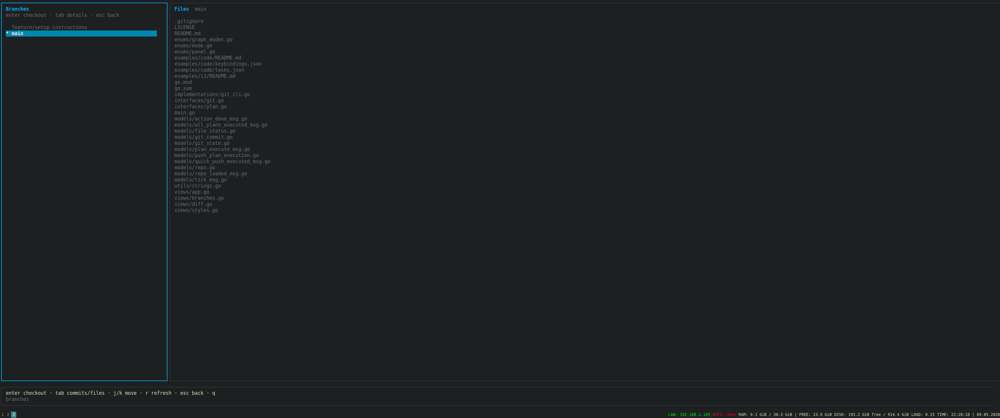
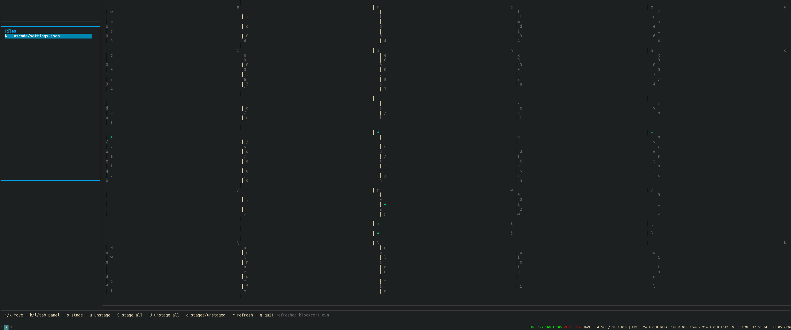
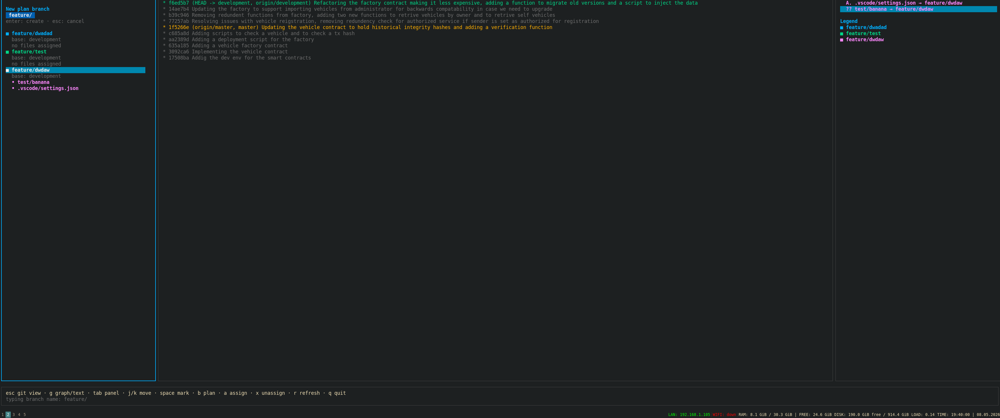
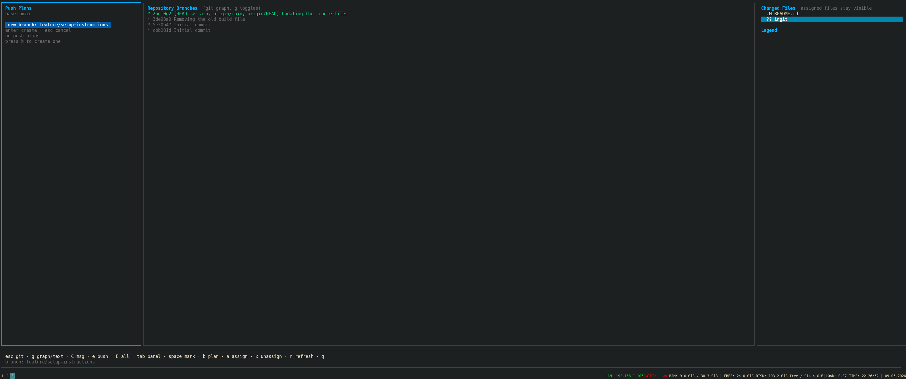
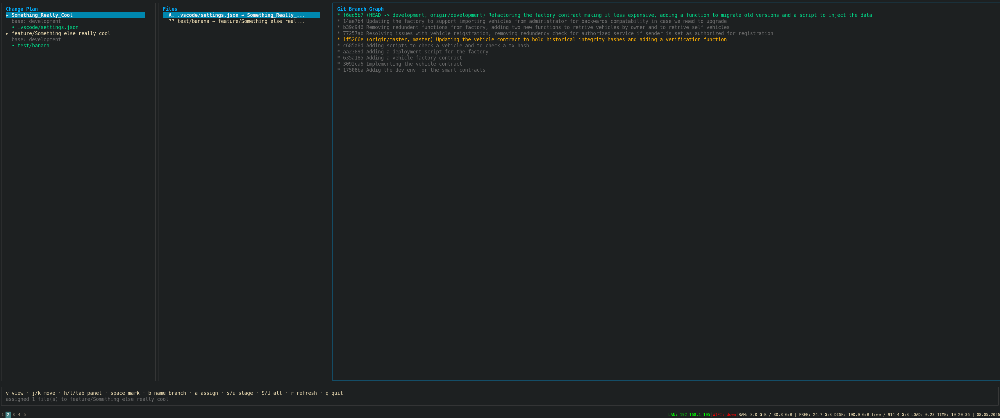
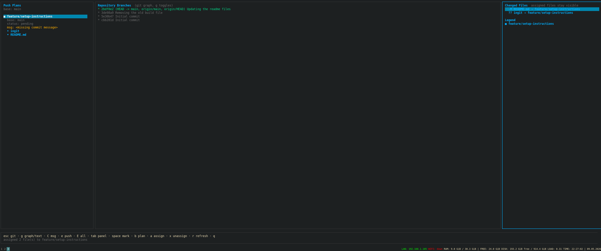
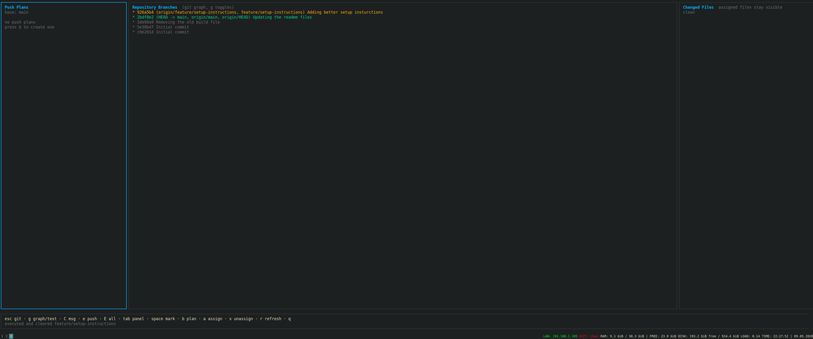
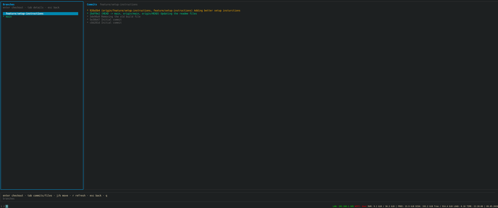

# ingit

A terminal-native Git workspace manager built for modern development workflows.

`ingit` focuses on:
- fast repository navigation
- structured commit planning
- multi-repository management
- branch exploration
- terminal-first workflows
- IDE integration

The goal is simple:
make working with Git faster and less disruptive without replacing Git itself.

---

# Preview

## Multi-Repository Overview



---

## Side-by-Side Diff View



---

## Push Planner

### Branch Planning



### File Assignment



### Repository Graph



### Execution Complete



---

## Branch Explorer

### Branch List



### Branch File Explorer



---

# Why ingit

Git CLI is powerful, but large projects introduce a different set of problems:
- multiple repositories
- many active branches
- large mixed commits
- rapid iteration
- terminal switching
- manually reorganizing changes

`ingit` is built around those workflows.

Instead of constantly jumping between terminals, editors, and Git commands, the idea is to keep everything accessible from a single terminal workspace.

The project is especially useful for:
- mono repositories
- microservice environments
- terminal-heavy workflows
- tiling window manager setups
- remote development
- SSH sessions

---

# Features

## Multi-Repository Workspace

Manage multiple repositories from one interface.

Useful for:
- mono repositories
- service-based architectures
- infrastructure repositories
- backend/frontend splits

---

## Quick Push

Fast commit and push flow for the current branch.

Designed for minimal interaction:
- open
- enter commit message
- push

---

## Push Planner

The planner allows large changes to be reorganized before committing.

Files can be:
- grouped into separate plans
- assigned to different branches
- committed independently
- executed sequentially

Repository state is not modified until execution.

This makes it possible to safely restructure work after development has already happened.

---

## Surgery Mode

The surgery mode allows large changes to single file to be split into multiple commits.
The idea is to have almost the same control as plans but on a file level.

Files can be:
- grouped into separate commit section
- each commit section has it's own dedicated commit message
- committed independently
- executed sequentially

Repository state is not modified until execution.

This makes it possible to safely restructure work after development has already happened.

---


## Branch Explorer

Browse:
- local branches
- remote branches
- commit history
- repository contents

Switch, merge, and delete branches directly from the TUI.

---

## Context-Aware Layout

If only one repository exists, repository management panels are automatically removed from the interface.

---

## Keyboard-Driven

Built for:
- terminal users
- keyboard navigation
- i3/sway users
- remote environments
- editor terminal workflows

---

# Integrations

`ingit` works anywhere a terminal can be launched.

Included examples:
- VS Code
- VSCodium
- i3

Additional integrations can be added easily.

See:
- `README_VSCODE.md`
- `README_I3.md`

---

# Building From Source

## Requirements

- Go 1.24+

## Build

```bash
git clone <repository>
cd ingit

go mod tidy
go build -o ingit .
```

---

## Optional Global Install

```bash
mkdir -p ~/.local/bin
cp ./ingit ~/.local/bin/ingit
chmod +x ~/.local/bin/ingit
```

Verify installation:

```bash
ingit
```

---

# Keybinds

## General

| Key | Action |
|-----|--------|
| `j/k` | Move selection |
| `h/l` | Change panel |
| `tab` | Cycle panels |
| `r` | Refresh |
| `q` | Quit |

---

## Git Mode

| Key | Action |
|-----|--------|
| `s` | Stage file |
| `u` | Unstage file |
| `S` | Stage all |
| `U` | Unstage all |
| `I` | Surgery Mode |
| `P` | Quick push |
| `p` | Open push planner |
| `B` | Open branch explorer |

---

## Push Planner

| Key | Action |
|-----|--------|
| `b` | Create branch plan |
| `space` | Mark file |
| `a` | Assign file |
| `x` | Remove file |
| `C` | Set commit message |
| `e` | Execute selected plan |
| `E` | Execute all plans |

---

## Branch Explorer

| Key | Action |
|-----|--------|
| `enter` | Checkout branch |
| `m` | Merge branch |
| `M` | Merge and delete |
| `d` | Delete branch |
| `tab` | Toggle commits/files |

---

# Philosophy

`ingit` is not trying to replace Git.

It exists to reduce friction around Git workflows.

The focus is:
- fast commits
- branch organization
- repository visibility
- terminal workflows
- minimal context switching

---

# Contributing

Pull requests, fixes, and workflow improvements are welcome.

If you build an integration for another editor or environment, feel free to add it.

---

# License

MIT
